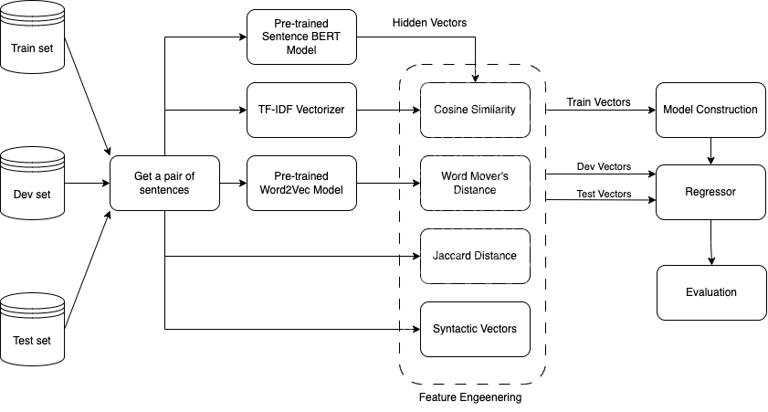

# semEval2024: Semantic Textual Relatedness - Pinealai Code 
## Description Task 1 English
A shared task on automatically detecting the degree of semantic relatedness between pairs of sentences. New textual datasets will be provided for Afrikaans, Algerian Arabic, Amharic, English, Hausa, Hindi, Indonesian, Kinyarwanda, Marathi, Moroccan Arabic, Modern Standard Arabic, Punjabi, Spanish, and Telugu.

Link of the shared task: [SemEval2024](https://github.com/semantic-textual-relatedness/Semantic_Relatedness_SemEval2024)

## Main objective
The main purpose for us was to identify and find features and explainable ways of the impact of those features in predicting semantic textual similarity in English.

## Brief Methodology
In this study, the objective is to predict semantic textual relatedness between two texts. We made
two key assumptions:
- We refrained from preprocessing the corpus to preserve sentence structure, essential for information retrieval and semantic identification (Hirst, 1987);
- We intentionally excluded Large Language Models (LLMs) from experiments(fine-tuning), anticipating challenges in interpreting specific features contributing to semantic identification due to their contextual abilities and complexity.

Below is the diagram of our method:



## How to use the Repo?
You don't need to run everything. If you set up the environment correctly, you can run the "synt.py" to get the models' performances in your terminal. The generated features in the repo will be used automatically for this purpose.

## How to reproduce The experiment and Improve it?
### Requirements
To be able to reproduce the work, you will need to create a virtual environment and install the dependencies we  used. The main ones are scikit-learn, spacy, nltk and sentence_transformers. But it is better, if you install the dependencies from the requirements.txt in the folder. For the Jupyter Notebook code, it will be easy to know the dependencies needed.

NB: The OS under which we perform the experiments is **LINUX UBUNTU 22.04**, concerning the scripts.

So, the first thing is to clone the repo, and set it locally:
``` 
git clone https://github.com/Anvi98/semEval2024_code.github 
```
Create the virtual environment and activate it. (you need to be located in the folder):
``` 
python3 -m venv env 
source env/bin/activate
``` 
Then, install the dependencies. (type 'pip' if not using python3):
``` 
pip3 install -r requirements.txt
``` 
After installing, the dependencies, everything is set. You will be able to run these files:
- embed.py (Extract Bert embedding)
- fuzzy_h.py (Computed Levenshtein distance of pair of sentences)
- syntactic_features.py (Extract syntactic features of pair of sentences)
- synt.py (Training and prediction of traditional ML models)


## Authors:
- Anvi Alex Eponon
- Luis Ramos
